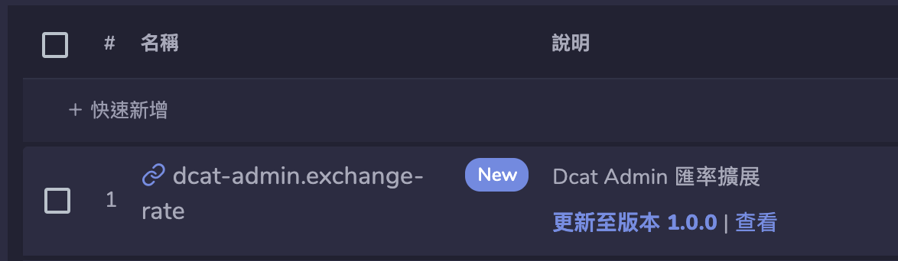
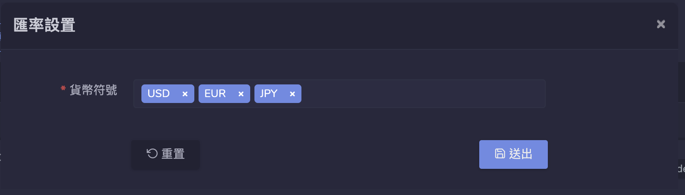
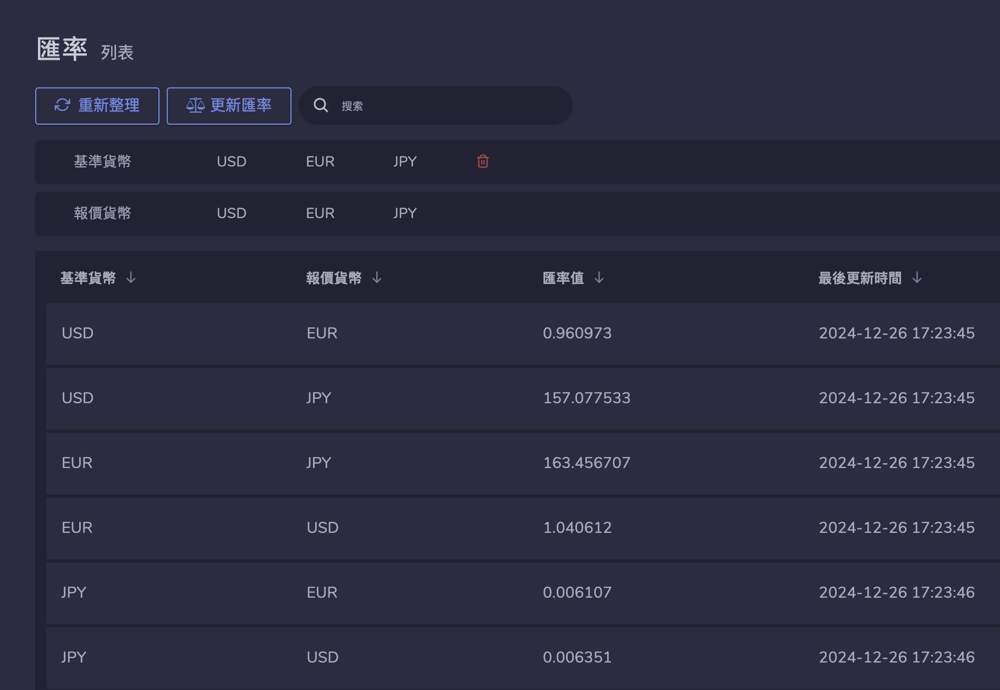
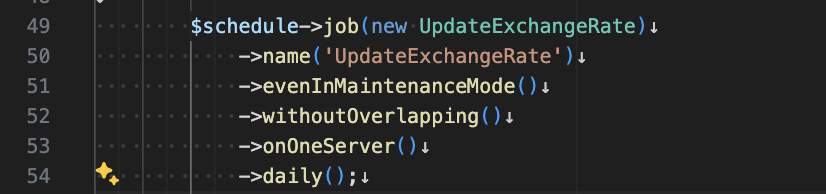

# Dcat Admin 匯率擴展

## 安裝

1. 安裝擴展。

   ```bash
   composer require elysiumrealms/extension-exchange-rate
   ```

2. 在後台「開發工具」「擴展」更新至最新版本，並啟用擴展。

   

3. 透過「擴展設置」設定「貨幣符號」。

   

4. 重新整理頁面，「匯率菜單」位於「系統」菜單中，執行「更新匯率」以獲取即時匯率。

   

## 自動更新匯率


